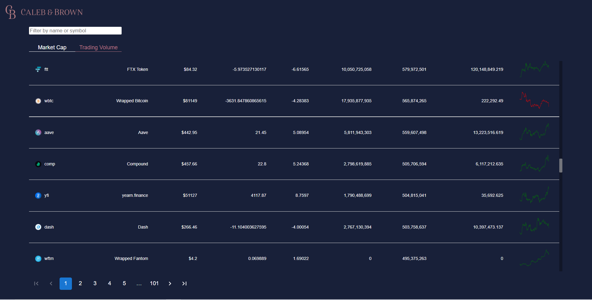

## Table of contents

  - [The challenge](#the-challenge)
  - [Screenshot](#screenshot)
  - [Links](#links)
  - [Built with](#built-with)
  - [What I learned](#what-i-learned)

### The challenge

This project was made during the interview process for a crypto-currency firm. It needed to cover the following:

- Display a paginated list of Cryptocurrencies and provide further information in an
appropriate form
- A loading state whilst data is being pulled and provide an error state if the call fails.
- A unit test for the component

### Screenshot

### Links

- Solution URL: (https://github.com/Dantedavidson/coinwatch)
- Live Site URL: (https://trusting-swirles-b8cf71.netlify.app/)

### Built with

- React
- Typescript
- Axios
- Jest
- Styled Components

### What I learned

This was a fun project and gave me a good opportunity to test out the victory library as well as use material ui's table component.

## Author

- Portfolio - (https://www.dantedavidsondaniele.com/)

